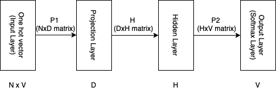

- 
- **Basic Idea**:
	- **Distributional hypothesis**: The meaning of a word is determined by the words that appear in the context of the given word.
	  id:: 65171585-d268-4984-8c18-5197bf423a28
	- Can we learn word embeddings/vectors efficiently on a large corpus using neural networks?
	- The learned word representations retain certain linear properties which helps them solve tasks of semantic and syntactic similarities.
	- The learned word embeddings are distributional representations (because of distributional hypothesis) as well as because the meaning of a word is spread across all the dimensions of the word representation. This is in contrast to the one-hot encoding where the meaning of the word is localised in a dimension (localised hypothesis).
	-
- **Model Architecture**
	- The training complexity of an architecture is proportional to:
	  \begin{equation}
	  O = E \times T \times Q
	  \end{equation}
	- where
	  * E is the number of training epochs
	  * T is the number of words in the training set
	  * Q is the defined as for each model architecture.
	- **Feedforward Neural Net Language Model (NNLM)**
	  id:: 651ef1e9-aa4c-44e4-8845-1d80e6ef0262
		- id:: 651ef207-9db4-4ce8-b284-ce26c1ccb25d
		  #+BEGIN_CENTER
		  
		  #+END_CENTER
		- ((651efa38-15c7-4909-91aa-4e1ce62381dc))
		- Typical values: $N=10$, $D=500-2000$ and $H=500-1000$
		- The computational complexity per each training example (i.e. word) is 
		  \begin{equation}
		  Q = N \times D + N \times D \times H + H \times V
		  \end{equation}
		  where 
		  * the first term comes due to the projection matrix $P1$. Note that the complexity is not $N \times D \times V$ because each word is represented as one-hot vector and hence only 1 column of $P1$ survives. There are $N$ words, so the complexity is $N \times D$.
		  * the last term doesn't have $N$ multiplier. Because after the hidden layer, the hidden representations of all $N$ words may be reduced to a single vector through sum or average operation.
		- Clearly, the dominant term is $H \times V$ in the above equation. However, we can use hierarchical softmax for reducing the complexity of this.
		  ((651efc94-037c-492c-ac5b-480d6a2d8609))
		- Therefore, the next computationally expensive term in the above equation is $N \times D \times H$.
-
- **New Log-Linear Models**
	- **Continuous Bag-of-Words Model**
		- #+BEGIN_CENTER
		  ((651eff96-306a-4e7e-998b-2027136c987a))
		  #+END_CENTER
		-
		- To reduce the complexity of the feedforward model, they get rid of the non-linear hidden layer.
		- ((651eff72-1cff-4d98-9fd7-2f0d478990fb))
	- **Continuous Skip-gram Model**
		- #+BEGIN_CENTER
		  ((651f008e-ce8b-4505-a722-5711b01fbb12))
		  #+END_CENTER
		- ((651f0154-5b91-43c3-a82b-7d606a59d354))
		  ((651f0168-1bb2-43a0-b954-244eb252e8c8))
		- Note that each pair `<middle word, randomly sampled word from 2R words>` is treated as a separate training example. Therefore, each middle word gives rise to $2R$ training examples.
- **Results**
	- Simple algebraic interpretation of word vectors:
		- ((65215800-45d8-45c3-bb47-eb27113bb7aa))
		-