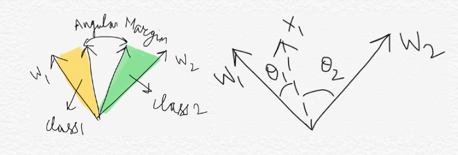

- 
- **Basic Idea**:
	- Is Euclidean margin always suitable for learning discriminative face features?
	- Ideally, we want face-features to have smaller maximal intra-class distance than minimal inter-class distance *under a suitably chosen metric space*.
	- The proposed A-softmax loss can be viewed as imposing discriminative constraints on a hypersphere manifold, which intrinsically matches the prior that faces also lie on a manifold.
	- Essentially, a normal softmax requires $cos(\theta_{1}) > cos(\theta_{2})$ to correctly classify an example belonging to class 1. We want a function $f(\theta_{1}, \theta_{2})$ such that $cos(\theta_{1}) > f(\theta_{1}, \theta_{2}) > cos(\theta_{2})$. This way we are making the decision boundary more stringent.
- **Proposed Approach**:
	- ((64d4d0a1-5f1a-4118-9b21-dc8ebea0149f))
	- For modified softmax loss (with $||W_{i}||=1, b_{i}=0$), the decision boundary is $cos(\theta_{1}) - cos(\theta_{2}) = 0$ (i.e. angular bisector of vector $W_{1}$ and $W_{2}$).
	- **Motivation:**
		- Assume a learned feature $x$ from class 1 is given and $\theta_{i}$ is the angle between $x$ and $W_{i}$, it is known that the modified softmax loss requires $cos(\theta_{1}) > cos(\theta_{2})$ to correctly classify $x$. But what if we instead require $cos(m\theta_{1}) > cos(\theta_{2})$ where $m \geq 2$ is an integer in order to correctly classify $x$? It is essentially making the decision boundary more stringent than previous, because we require a lower bound of $cos(\theta_{1})$ to be larger than $cos(\theta_{2})$.
		- The above is true, because the inequality $cos(\theta_{1}) > cos(m\theta_{1})$ holds while $\theta_{1} \in \left [0, \frac{\pi}{m} \right ], m \geq 2$, which is true because within $[0,\pi ]$, $cos$ is a monotonically decreasing function.
		- Essentially, a normal softmax requires $cos(\theta_{1}) > cos(\theta_{2})$ to correctly classify an example belonging to class 1. We want a function $f(\theta_{1}, \theta_{2})$ such that $cos(\theta_{1}) > f(\theta_{1}, \theta_{2}) > cos(\theta_{2})$. This way we are making the decision boundary more stringent.
		- From angular perspective, correctly classifying $x$ from identity 1 requires $\theta_{1} < \frac{\theta_{2}}{m}$, while correctly classifying $x$ from identity 2 requires $\theta_{2} < \frac{\theta_{1}}{m}$.
		-
	- **Lemma**: *Suppose all training examples are correctly classified, such decision boundaries will produce an angular margin of* $\frac{m-1}{m+1}\theta_{2}^{1}$, *where* $\theta_{2}^{1}$ *is the angle between* $W_{1}$ *and* $W_{2}$.
		- 
		- Let $x_{1} \in$ class 1 and lies on the decision boundary. Therefore, for $x_{1}, m\theta_{1} = \theta_{2}$. Now, $\theta_{1} + \theta_{2} = \theta_{2}^{1}$. So, for $x_{1}$, 
		  \begin{aligned}
		  \theta_{1} + \theta_{2} &= \theta_{2}^{1} \\
		  \theta_{1} + m\theta_{1} &= \theta_{2}^{1} \\
		  \theta_{1} &= \frac{\theta_{2}^{1}}{m+1}
		  \end{aligned} 
		  Therefore, for any $x$ lying on the decision boundary and being correctly classified as class 1, $\theta_{1} = \frac{\theta_{2}^{1}}{m+1}$.
		- Similarly, for any $x$ lying on the decision boundary and being correctly classified as class 2, $\theta_{2} = \frac{\theta_{2}^{1}}{m+1}$.
		- Angular gap between these two decision boundaries (angular margin) is ![IMG_5198.jpg]
		  \begin{aligned}
		   & = \theta_{2}^{1} - \theta_{1} - \theta_{2} \\ 
		  &= \theta_{2}^{1} \left [ 1 - \frac{1}{m+1} - \frac{1}{m+1} \right ] \\
		  &= \frac{m-1}{m+1}\theta_{2}^{1}
		  \end{aligned}
	- **A-Softmax function**:
		- The above idea can be directly incorporated into the modified softmax:
		  \begin{equation}
		  L_{ang} = \frac{1}{N} \sum_{i} - log \left(\frac{e^{||x_{i}||cos(m\theta_{y_{i}, i})}}{e^{||x_{i}||cos(m\theta_{y_{i}, i})} + \sum_{j \neq y_{i}}e^{||x_{i}||cos(m\theta_{j, i})}} \right )
		  \end{equation}
		  where $\theta_{j, i} (0 \leq \theta_{j, i} \leq \pi)$ is the angle between vector $W_{j}$ and $x_{i}$ and $\theta_{y_{i}, i}$ has to be in the range of $\left [0, \frac{\pi}{m} \right]$ so that the inequality $cos(\theta_{1}) > cos(m\theta_{1})$ holds while $\theta_{1} \in \left [0, \frac{\pi}{m} \right ], m \geq 2$ can be satisfied.
		- In order to get rid of the last restriction and make it optimisable in CNNs, we expand the definition range of $cos(\theta_{y_{i}, i})$ by generalising it to a monotonically decreasing angle function $\psi(\theta_{y_{i}, i})$ which should be equal to $cos(\theta_{y_{i}, i})$ in $\left [0, \frac{\pi}{m} \right]$. Therefore, the proposed A-Softmax loss is formulated as:
		  \begin{equation}
		  L_{ang} = \frac{1}{N} \sum_{i} - log \left(\frac{e^{||x_{i}||\psi(m\theta_{y_{i}, i})}}{e^{||x_{i}||\psi(m\theta_{y_{i}, i})} + \sum_{j \neq y_{i}}e^{||x_{i}||cos(m\theta_{j, i})}} \right )
		  \end{equation}
		  where,
		  \begin{equation}
		  \psi(\theta_{y_{i}, i}) = 
		  (-1)^k cos(m\theta_{y_{i}, i}) - 2k
		  \end{equation}
		  $\theta_{y_{i}, i} \in \left [ \frac{k \pi}{m}, \frac {(k+1) \pi}{m} \right]$ and $k \in [0, m-1]$.
		- $m \geq 1$ is an integer that controls the size of the angular margin. When $m=1$, it becomes the modified softmax loss.
		-